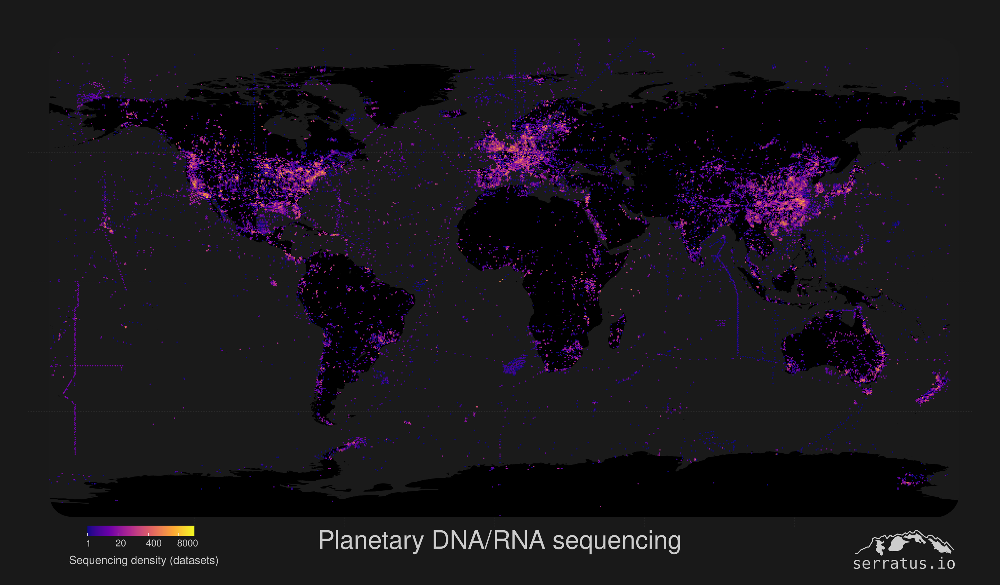

# BioAnnotate
Annotation-layer for the INSDC BioSample database

## Motivation
The [BioSample](https://www.ncbi.nlm.nih.gov/biosample/) database contains descriptive meta-data for all _biological samples_ housed by the "International Nucleotide Sequence Database Collaboration", the world's central repository for biological sequence data.

Due to the diversity of available samples and their descriptions, the meta-data is not standardized. Each record is stored as an XML file, containing its own set of tags and values.

`BioAnnotate` provides an annotation layer for `BioSample` to aggregate similar tags and standardize the value formats.

## Goal
There are `42,125` unique 'tags' across >10.7 million BioSample XML files. We will annotate these tags into 4 categories, to allow for data-aggregation and ultimately a "clean" database.

- `geo`:  Geographic names and spatial coordinates
- `date`: Sample collection date and/or release date
- `organism`: Host or Pathogen species
- `ecosystem`: Environmental origin description or body-site

# Contributing

### [BioAnnotation Spreadsheet](https://docs.google.com/spreadsheets/d/1J-kYYDBv3K5HFYMiHhSseEcpW8TQ3ilbSxfynXNtzKo/edit?usp=sharing)

We will work on a collaborative [Annotation Spreadsheet](https://docs.google.com/spreadsheets/d/1J-kYYDBv3K5HFYMiHhSseEcpW8TQ3ilbSxfynXNtzKo/edit?usp=sharing) which contains every unique BioSample tag.

Sign-up on the `Lockout` sheet to annotate a 'chunk' of 2,500 rows in the `biosample_tags` sheet for a particular class of data (see below).

The default for all tags is set to `F` for "FALSE". If a `biosample_tag` describes a field which is pertinent to your data-class, change this value to `T` for "TRUE".

If you are unsure of how to classify a particular `biosample_tag`, set the value to `?` and/or ask in the chat.

### Example Workflow

Kat would like to annotate Chunk `C` for `geo` data.

1. She reviews the `geo` data class description below to understand the inclusion and exclusion criteria for this data-class.

2. She enters her name on the `Lockout` sheet to indicate she has begun to work on this chunk.

3. On the `biosample_tags` sheet Chunk corresponds to Rows `5001 - 7500` and the `geo_name` and `geo_coord` columns.

4. After turning on some [good jams](https://www.youtube.com/watch?v=iuWa5wh8lG0), she annotates these rows.

5. Upon completing her annotation, she updates `Lockout` to indicate this chunk is complete and she can begin working on another Chunk.

## Data Classes

### geo data

**Inclusion**: Tags which can provide any location data. Imagine the keywords you could type into Google Maps. e.g. `geo_location`, `country`, `national_park`, `sequencing_institute`, `lake_name`, `longitude`, `lat_long`, `geo_coordinates`...

**Exclusion**: Tags which describe a generic environment, not geographically specific. e.g. `snow_depth`, `nitrogen_content_soil`, `lake_type`...

- `geo_name` : Set to `T` if tag likely contains words describing geo-data.

- `geo_coord` : Set to `T` if tag likely contains numbers describing geo-data, mainly longitude / latitude / altitude.

### date data

**Inclusion**: Tags which would contain a date. e.g. `collection_date`, `sample_date`, `sequencing_date`, `release_date`...

**Exclusion**: Tags which contain time-course data, such as the timeline of an experiment. e.g. `week_of_growth`, `hours`...

- `collection_date` : Set to `T` if tag specifically describes the time at which a sample was collected from nature.

- `other_date` : Set to `T` if tag contains a date.

### organism data

**Inclusion**: Tags which can provide taxonomic information regarding the organism which had been sampled. e.g. `species`, `genus`, `scientific_order`, `taxonomy_string`

**Exclusion**: Tags which describe a generic component of an organism. e.g. `leaf_type`, `fur_colour`, `paw_length`...

- `host_species` : Default choice to set to `T` for this class

- `virus_species` : Set to `T` if tag specifically indicates a viral organism classification.

### ecosystem data

**Inclusion**: Tags which can provide an environmental or organism-tissue description of the samples origin. e.g. `water_depth`, `wastewater_site`, `soil_moisture`, `brain_region`, `tumour_diameter`, `organ_site`... 

- `ecosystem` : Set to `T` if tag describe the samples environment.

- `bodysite` : Set to `T` if tag describes an organism's site.

# Building Knowledge

An example use-case for this data showing the spatial-distribution of several million DNA or RNA sequencing datasets in the 'Sequence Read Archive'. Geographic data was extracted from BioSample, but >50% of the data is missing due to inconsitent naming, we're going to fix that!